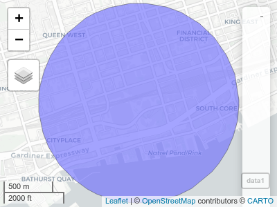
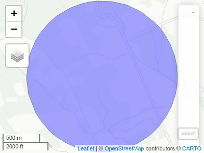
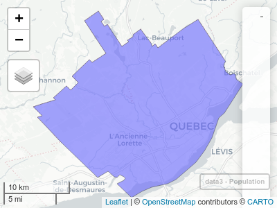
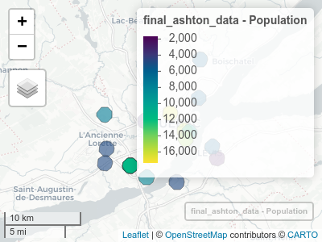

<!-- README.md is generated from README.Rmd. Please edit that file -->

# cangetpop

The goal of cangetpop is to return the canadian population within a
polygon. There are helper functions to generate a circle of any given
radius (in kilometers) around a given longitude.

## Installation

You can install cangetpop from github using

``` r
devtools::install_github("simoncoulombe/cangetpop")
```

## Example

This is a basic example which shows you how to solve a common problem:

``` r
suppressMessages(
  suppressWarnings({
    library(dplyr)
    library(magrittr)
    library(cangetpop)
    library(osmdata)
    library(sf)
    library(purrr)
    library(cancensus)
    library(mapview)
  })
)
## basic example code
```

get\_populations\_from\_address\_radius() needs an address (without the
postal code) and a radius in kilometers:

``` r
data1 <- get_populations_from_address_radius("CN tower, toronto, canada", 1 )
print(data1)
#> Simple feature collection with 1 feature and 1 field
#> Geometry type: POLYGON
#> Dimension:     XY
#> Bounding box:  xmin: -79.39948 ymin: 43.63356 xmax: -79.37469 ymax: 43.65156
#> Geodetic CRS:  WGS 84
#> # A tibble: 1 x 2
#>                                                              geometry Population
#>                                                         <POLYGON [°]>      <dbl>
#> 1 ((-79.37469 43.64239, -79.37472 43.64192, -79.37479 43.64145, -79.…     48759.
```

``` r
mapview(data1)
```



get\_populations\_from\_lat\_lon\_radius() needs a latitude and
longitude (in degrees) and a radius in kilometers:

``` r
data2 <- get_populations_from_lat_lon_radius(45, -65, 1 )
data2
#> Simple feature collection with 1 feature and 1 field
#> Geometry type: POLYGON
#> Dimension:     XY
#> Bounding box:  xmin: -65.01268 ymin: 44.991 xmax: -64.98732 ymax: 45.009
#> Geodetic CRS:  WGS 84
#> # A tibble: 1 x 2
#>                                                              geometry Population
#>                                                         <POLYGON [°]>      <dbl>
#> 1 ((-64.98732 45.00022, -64.98732 44.99975, -64.98736 44.99928, -64.…       76.0
```

``` r
mapview::mapview(data2)
```



get\_populations\_from\_polygon() simply takes a polygon as input

``` r
bb_sf <- getbb("Quebec, QC", format_out = "sf_polygon")[1,] ## polygon of quebec city
data3 <- get_populations_from_polygon((bb_sf))
data3
#> Simple feature collection with 1 feature and 1 field
#> Geometry type: POLYGON
#> Dimension:     XY
#> Bounding box:  xmin: -71.54922 ymin: 46.72771 xmax: -71.13366 ymax: 46.98068
#> Geodetic CRS:  WGS 84
#>   Population                       geometry
#> 1   551102.2 POLYGON ((-71.54922 46.8511...
```

``` r
mapview(data3, zcol ="Population")
```



Here’s an example returning the population around the 14 “Ashton”
restaurants in Quebec city

Voici les coordonnées des restaurants Ashton de Québec trouvées avec
{osmdata}

``` r
bb <- getbb("Quebec, QC")

x <- bb %>% opq() %>%
  add_osm_feature(key= "name", value = c("ASHTON", "ASTHON"),
                  value_exact = FALSE, match_case = FALSE
  )%>%
  osmdata_sf()

ashton <- x$osm_points %>% 
  filter(!(osm_id %in% c(1750439777,1750439789, 1750439808, 1750439833,  1750439845, 1616297363, 1616297367, 1616297399)))  %>% ## some restaurants have multiple points.. keep only one
  dplyr::mutate(longitude = sf::st_coordinates(.)[,1],
                latitude = sf::st_coordinates(.)[,2])


data0 <- ashton %>% 
  st_drop_geometry() %>% 
  select(osm_id, latitude, longitude) %>% 
  mutate( pouet = pmap(list(latitude, longitude, 1),
                       get_populations_from_lat_lon_radius)
  )

final_ashton_data <- bind_rows(data0$pouet) %>% bind_cols(data0 %>% select(-pouet)) %>% mutate(Population = round(Population))

final_ashton_data
#> Simple feature collection with 20 features and 4 fields
#> Geometry type: POLYGON
#> Dimension:     XY
#> Bounding box:  xmin: -71.36829 ymin: 46.74695 xmax: -71.14995 ymax: 46.9078
#> Geodetic CRS:  WGS 84
#> # A tibble: 20 x 5
#>                                   geometry Population osm_id  latitude longitude
#>  *                           <POLYGON [°]>      <dbl> <chr>      <dbl>     <dbl>
#>  1 ((-71.18129 46.85416, -71.18129 46.853…       5439 291667…     46.9     -71.2
#>  2 ((-71.264 46.87103, -71.264 46.87056, …       8179 303684…     46.9     -71.3
#>  3 ((-71.34208 46.83502, -71.34208 46.834…       6910 403654…     46.8     -71.4
#>  4 ((-71.22994 46.83655, -71.22994 46.836…      17357 162889…     46.8     -71.2
#>  5 ((-71.20544 46.81631, -71.20544 46.815…      16408 162890…     46.8     -71.2
#>  6 ((-71.33872 46.79502, -71.33871 46.794…       4719 175043…     46.8     -71.4
#>  7 ((-71.2703 46.76192, -71.27029 46.7614…       7878 204136…     46.8     -71.3
#>  8 ((-71.3412 46.77836, -71.3412 46.77789…       4583 219480…     46.8     -71.4
#>  9 ((-71.19726 46.81458, -71.19726 46.814…       9621 237663…     46.8     -71.2
#> 10 ((-71.27291 46.82764, -71.27291 46.827…       2503 239780…     46.8     -71.3
#> 11 ((-71.14995 46.78408, -71.14995 46.783…       1715 253848…     46.8     -71.2
#> 12 ((-71.20346 46.8068, -71.20346 46.8063…      15598 282624…     46.8     -71.2
#> 13 ((-71.17875 46.89905, -71.17875 46.898…       5777 284322…     46.9     -71.2
#> 14 ((-71.29806 46.77549, -71.29805 46.775…      11812 303995…     46.8     -71.3
#> 15 ((-71.29806 46.77548, -71.29806 46.775…      11815 304000…     46.8     -71.3
#> 16 ((-71.29779 46.77551, -71.29779 46.775…      11799 304002…     46.8     -71.3
#> 17 ((-71.29799 46.77541, -71.29799 46.774…      11848 304002…     46.8     -71.3
#> 18 ((-71.29786 46.77558, -71.29786 46.775…      11762 304003…     46.8     -71.3
#> 19 ((-71.21896 46.7562, -71.21896 46.7557…       4391 651754…     46.8     -71.2
#> 20 ((-71.15792 46.79768, -71.15792 46.797…       5207 806677…     46.8     -71.2
```

``` r
mapview(final_ashton_data, zcol = "Population")
```


